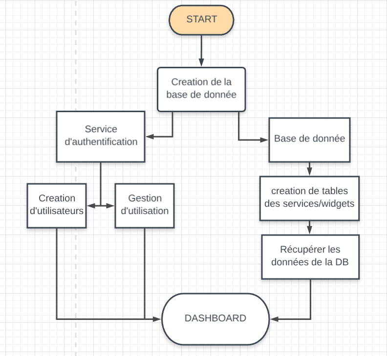

# EpitechDashboardAngular

This project was generated with [Angular CLI](https://github.com/angular/angular-cli) version 6.2.5.

## Development server

Run `npm start` for a dev server. Navigate to `http://localhost:8080/`. The app will automatically reload if you change any of the source files.

## Build

Run `ng build` to build the project. The build artifacts will be stored in the `dist/` directory. Use the `--prod` flag for a production build.

## Further help

To get more help on the Angular CLI use `ng help` or go check out the [Angular CLI README](https://github.com/angular/angular-cli/blob/master/README.md).

## Widgets available

1. weather
2. calendrier
3. Google Map

## Services Available
1. Service Météo
2. Service Calendar
3. Service Google Map

## Conception du Projet

* creation de la base de donnée
        * Service d'authentification
                * Création d'utilisateurs
                * Gestion d'utilisation
        * Gestion Base de données
                * Creation de tables des services / Widgets
                        * Récupération des données de la DB